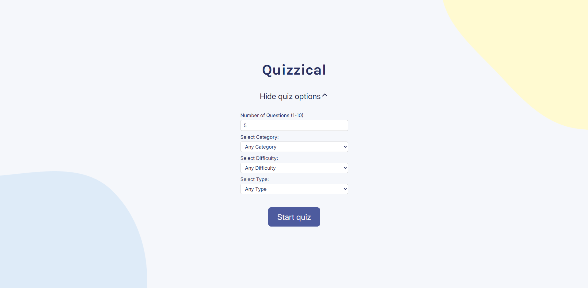
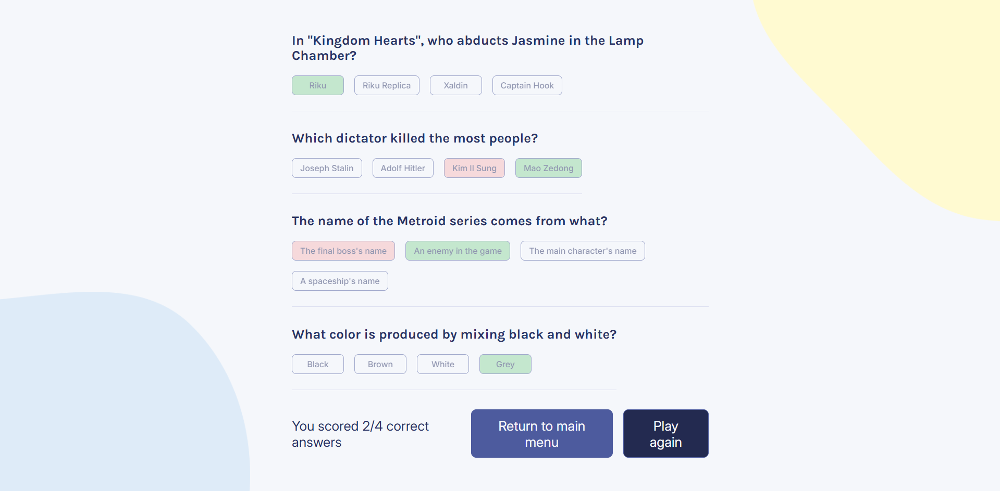

# Quizzical

A trivia quiz app built with React 19. Users can configure the quiz (number of questions, category, difficulty, and type), answer questions pulled live from the Open Trivia DB API, and see their score with correct/incorrect answers highlighted.

Built as a solo project from Scrimba's Frontend Career Path, implemented from a Figma design spec.

**🔗 Live demo:** https://ft-quizzical.netlify.app/




## Features

- Configurable quiz options: number of questions (1–10), category, difficulty, and question type
- Live data fetched from the [Open Trivia DB](https://opentdb.com/) API
- Loading state while fetching questions
- Error handling: shows a friendly message and a "return to menu" button if the API request fails (including rate-limit errors)
- Answer checking with correct/incorrect highlighting after submission
- Ability to change quiz options and start a new game after finishing
- Responsive layout

## Tech stack

- [React 19](https://react.dev/) (function components, hooks, native form actions)
- [Vite](https://vitejs.dev/) — build tool and dev server
- Plain CSS
- [clsx](https://github.com/lukeed/clsx) — conditional class names
- [he](https://github.com/mathiasbynens/he) — decoding HTML entities from the API
- [react-icons](https://react-icons.github.io/react-icons/) — UI icons

## Getting started

```bash
git clone https://github.com/Loud-Environment/quizzical-app.git
cd quizzical-app
npm install
npm run dev
```

The app will be available at `http://localhost:5173` (or whichever port Vite prints).

## What I learned

- Working with a third-party REST API: handling loading, success, and error states cleanly
- Managing more complex, interdependent state (quiz options → API query params → quiz data → user answers → score)
- Using React 19's native `<form action={...}>` pattern instead of manual `onSubmit` handlers
- Turning a Figma design into a responsive, working UI from scratch

## Next steps

- Improve accessibility further: announce correct/incorrect answers for screen readers, add `aria-expanded` and `aria-controls` to the show/hide options toggle
- Add a few small visual polish passes (spacing, transitions on interactive elements)
- Possibly add Login options and save results for personal statistics, which sounds super fun
